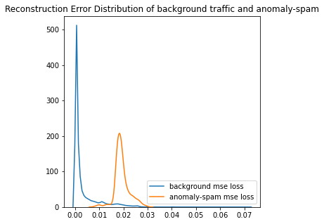
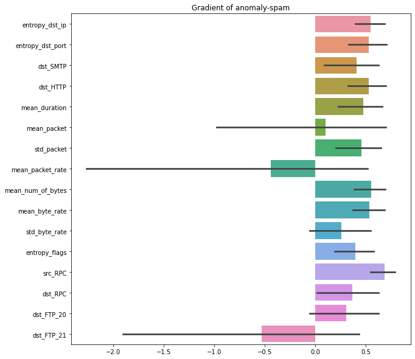

# GEE: A Gradient-based Explainable Variational Autoencoder for Network Anomaly Detection

## How to Use

### Install Dependencies
Create a new conda environment
```
conda create -n gee python=3.7.7
conda activate gee 
conda install pyspark=3.0.0 click=7.1.2 jupyterlab=2.1.5 seaborn=0.10.1
conda install pytorch=1.5.1 torchvision=0.6.1 cudatoolkit=10.1 -c pytorch
conda install pytorch-lightning=0.8.4 shap=0.35.0 -c conda-forge
pip install petastorm==0.9.2
```

### Feature Extraction
Download the processed data [here](https://drive.google.com/file/d/1I2x2l__TKcpg7nhcIkfsEFE6LZrodH9H/view?usp=sharing) or perform all the following steps.

1. Download raw data [march_week3_csv.tar.gz](https://nesg.ugr.es/nesg-ugr16/download/normal/march/week3/march_week3_csv.tar.gz) and [july_week5_csv.tar.gz](https://nesg.ugr.es/nesg-ugr16/download/attack/july/week5/july_week5_csv.tar.gz).
2. Decompress files.
   ```
   tar -xvf march_week3_csv.tar.gz
   tar -xvf july_week5_csv.tar.gz
   ```
3. Separate files by data.
   ```
   grep '^2016-03-18' march.week3.csv.uniqblacklistremoved >> 20160318.csv
   grep '^2016-03-19' march.week3.csv.uniqblacklistremoved >> 20160319.csv
   grep '^2016-03-20' march.week3.csv.uniqblacklistremoved >> 20160320.csv
   grep '^2016-07-30' july.week5.csv.uniqblacklistremoved >> 20160730.csv
   grep '^2016-07-31' july.week5.csv.uniqblacklistremoved >> 20160731.csv
   ```
4. Put `20160319.csv` and `20160730.csv` to `data/train folder`, `20160318.csv`, `20160320.csv`, and `20160731.csv` to `data/test` folder.
5. Perform feature extraction.
   ```
   python feature_extraction.py --train data/train --test data/test --target_train feature/train.feature.parquet --target_test feature/test.feature.parquet
   ```

### Normalise and Prepare Input Data for Model
Download the processed data [here](https://drive.google.com/file/d/1nl-FJpI_KDjPUQn-xHj5Sjbq0kYic0eC/view?usp=sharing) or perform all the following steps.

```
python build_model_input.py --train feature/train.feature.parquet --test feature/test.feature.parquet --target_train model_input/train.model_input.parquet --target_test model_input/test.model_input.parquet
```

### Train Model
Download pre-trained model [here](https://drive.google.com/file/d/17dMRZEbvPed2-WKuHDJwGZXP72hrM5yt/view?usp=sharing) or perform all the following steps.

```
python train_vae.py --data_path model_input/train.model_input.parquet --model_path model/vae.model --gpu True
```

## Evaluation

### ROC


### Reconstruction Error Distribution


### Gradient

